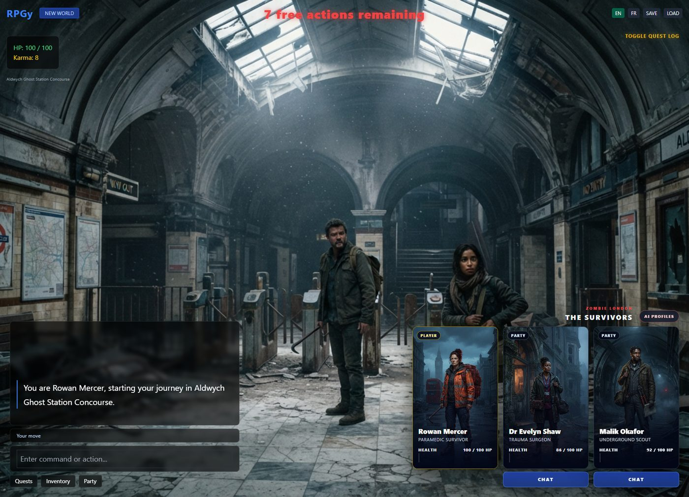
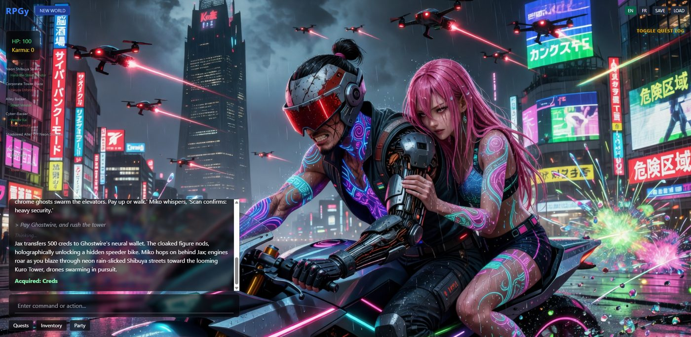

# RPGy - a world that talks back

<p align="center"></p>

<p align="center">
  <b>A text-RPG engine with a Game Master brain. Describe any world; play it, illustrated, with a Party that argues back.</b><br>
  <sub>Play it at <a href="https://www.rpgy.app/">rpgy.app</a> · Part of <a href="https://github.com/yeme-oss/Trinifty"><b>Trinifty</b></a> - all nifty stuff - all for free</sub>
</p>

<p align="center">
  <a href="https://www.patreon.com/c/PierreIgorZarebski"></a>
  
</p>

---

> *"You are never alone at the table. A living Party remembers, wants, argues, and acts, while the Director keeps the story moving toward you."*

## What is it?

You write one sentence. RPGy builds the world, your character, your companions and an opening crisis, then illustrates every scene as you play. The AI tells the story; the **engine keeps the truth** (HP, inventory, map, quests), so the story can't forget that you're wounded.

<table>
  <tr>
    <td width="50%"><br><sub><b>Zombie London.</b> Your Party sits on screen, each with HP, role and a Chat button.</sub></td>
    <td width="50%"><br><sub><b>Cyber-Samurai Tokyo.</b> Drones, neon, and a companion whispering "Scan confirms: heavy security."</sub></td>
  </tr>
</table>

## Features

- **49 authored worlds** ready to play, in `worlds.json` and `world/`.
- **World Constructor**: write one *Master Prompt* and the Director drafts every field (genre, tone, stakes, first choice, hero art). Edit anything before the world is built.
- **A living Party**: companions have personalities and relationship scores, interject on their own, and you can chat with any of them in private.
- **Karma-morphing world**: your choices secretly reshape what the Director generates.
- **Procedural map** that grows as you explore.
- **Fail-forward, no Game Over**: lose a fight and you're captured, robbed or rescued, then the story continues.
- **Illustrated scenes and portraits**, photoreal or cartoon.
- **Optional voices and music** (ElevenLabs).
- **Save / Load** as a plain `.json` file; **share links** publish an immutable snapshot of your world.
- **English and French.**

## Your key, your browser

RPGy is free. There is no account, no credit counter and no paywall. You paste **your own Gemini API key** into the page; your browser talks to Google directly and **RPGy never receives your key** (it's never in a save or a share link either). Tip: set a small Google Cloud billing limit, such as $10, so you stay in control.

## Run it yourself

You need [Node.js](https://nodejs.org/) 20+ and the [Vercel CLI](https://vercel.com/docs/cli) (the API routes are serverless functions).

```bash
npm install
cp .env.example .env     # everything in it is optional
npx vercel dev           # http://localhost:3000
```

Open the page, click **UNLOCK WITH YOUR GEMINI API KEY**, paste your key, pick a world. To host your own copy, `vercel deploy` works as-is.

**Optional services** (see [`.env.example`](.env.example)): an Upstash Redis database enables share links and the live player counter; ElevenLabs enables voices and music; Replicate enables talking-head video.

## How it works

```
index.html, css/, js/   Vanilla JS + Tailwind front end (js/engine.js holds the game state)
api/                    Serverless routes: prompt building and validation for the Director,
                        party turns, dialogue, portraits, share links, presence
worlds.json, world/     The 49 worlds and their art
assets/                 Preset rosters, landing art
docs/DESIGN.md          The original design document the engine was built from
```

The Director must answer in strict JSON, which the engine sanitizes and validates before it touches the game state. See [`docs/DESIGN.md`](docs/DESIGN.md) for the original design.

## License

**CC0 1.0: public domain.** Do whatever you like. See [LICENSE](LICENSE) and [NOTICE.md](NOTICE.md).

## Support

If RPGy gave you a good evening, consider [becoming a patron](https://www.patreon.com/c/PierreIgorZarebski). More at **[Trinifty](https://github.com/yeme-oss/Trinifty)**.
